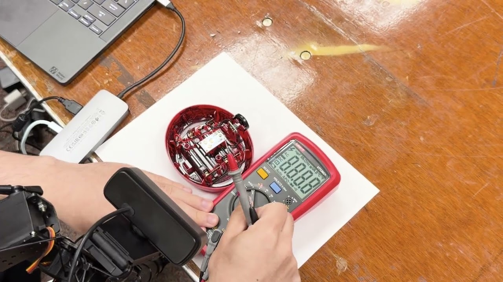
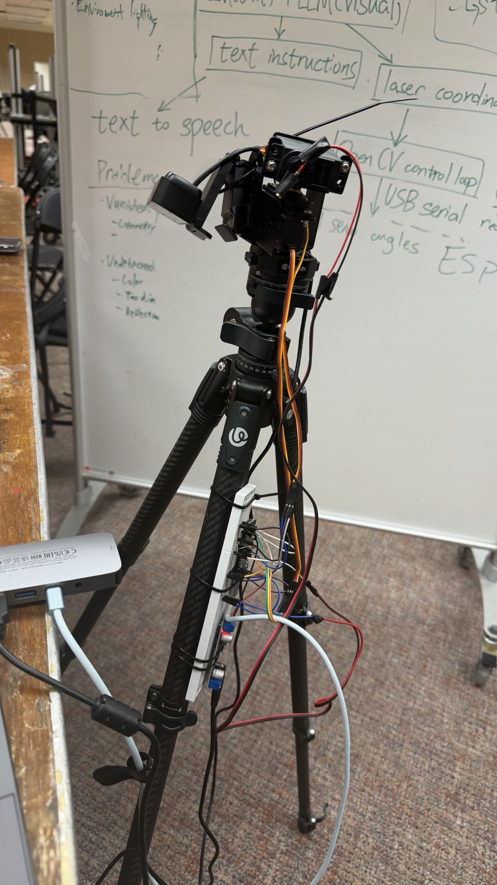
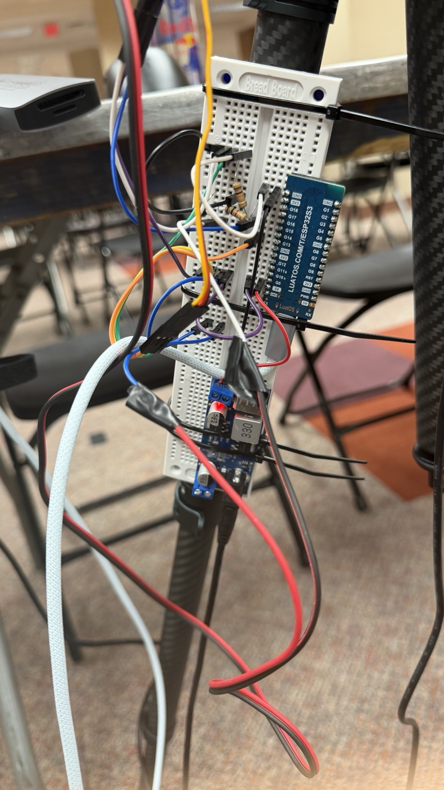
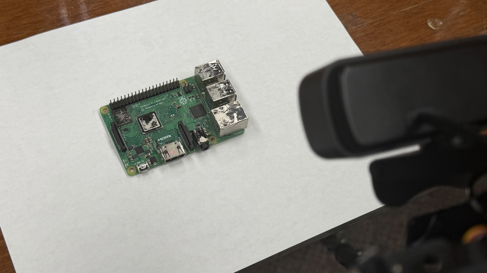
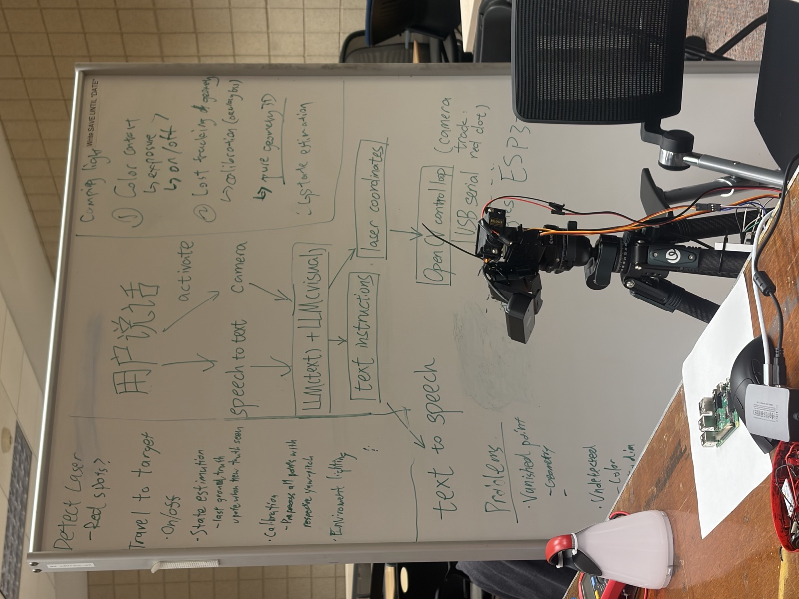
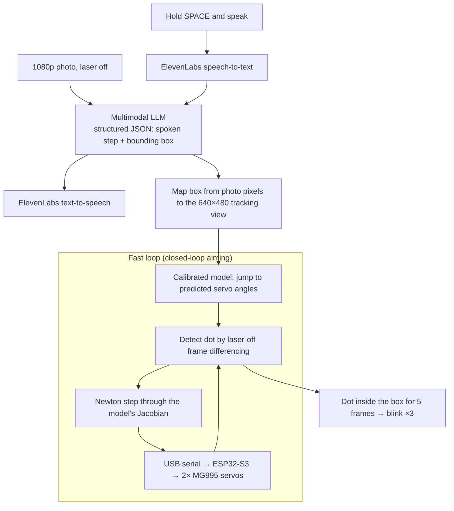

# MFix: an AI repair assistant that can point

**Describe what's broken. MFix looks at your device, talks you through the
troubleshooting, and points a laser at the part to check next.**

Built at **MHacks 2026** · [Devpost](https://devpost.com/software/mfix-ib1gxz) · [Demo video](https://www.youtube.com/watch?v=gkyN0jZfsyI)

[](https://www.youtube.com/watch?v=gkyN0jZfsyI)

<sub>▶ Click to watch the demo on YouTube.</sub>

## Why

The best repair help is someone who knows what they're doing, standing over
your shoulder and pointing: *"no, that one."* AI chatbots made knowing *what*
to do free. Ask one why your Raspberry Pi shows "no signal" and it will tell
you to check the HDMI port. It can't show you which of the forty small silver
parts on the board is the HDMI port. People get stuck turning words into a
physical place. A device someone gives up on usually ends up in a drawer and
then a landfill.

The world generated 62 million tonnes of e-waste in 2022, and only 22.3% of it
was documented as properly collected and recycled (UN Global E-waste Monitor
2024). Repair beats recycling: a device that gets fixed doesn't need to be
replaced.

So we asked: **what if the AI could point?**

## What it does

MFix is a webcam and a laser on a two-axis servo gimbal. You set it up over
whatever is broken, hold the spacebar and talk.

1. **You describe the problem out loud.**
2. **It looks.** While you're still talking, the camera takes a full-resolution
   photo of the device.
3. **It reasons.** A multimodal LLM (OpenAI GPT-6.1 Sol by default) takes your
   words and the photo, then decides the next diagnostic step and which
   component that step is about.
4. **It speaks and points.** You hear the instruction while a red dot moves to
   that component. When the dot arrives, it blinks three times to say *here*.
5. **Repeat until it's fixed.** If someone bumps the tripod, the dot finds its
   way back to the part.

<details>
<summary><b>Example from the demo: a camping lamp that won't turn on</b></summary>

> **You:** "My camping lamp won't turn on. I've opened it up. Where do I start?"
>
> **MFix:** *(dot lands on the white circuit board)* "I can see the battery
> holder, the switch and this small white circuit board wired between them.
> When a lamp is completely dead, a broken wire is a common cause, so let's test
> the wires around this board with a multimeter."
>
> **You:** "Okay, I have a multimeter, but I've never used one."
>
> **MFix:** *(dot moves to the continuity setting on the dial)* "Turn the dial to
> this setting and press Select. This is continuity mode: when the two probes
> are connected, it reads zero and beeps, and a good wire will do the same."
>
> **You:** "It beeps and shows zero."
>
> **MFix:** *(dot moves to the bottom battery connector)* "Good, the meter works.
> Put one probe on this battery connector, then follow the red wire to the
> top-left pad of the white board and touch the other probe there."
>
> **You:** "That one beeps."
>
> **MFix:** *(dot slides to the board's top-right pad)* "Then that wire is fine.
> Now put a probe on this pad and follow the black wire to the switch with the
> other probe."
>
> **You:** "No beep. Oh, the wire has come off the pad."
>
> **MFix:** *(dot holds on the empty pad)* "That's the fault. The black wire
> broke off this pad, so no power reaches the switch. Solder it back onto this
> pad and the lamp should turn on again."

Five turns, one solder joint and no screen. The lamp stays out of the trash.

</details>

## Results

| | |
| --- | --- |
| **Pointing accuracy** | 5.1 px median error from target center (640×480 view) across 27 camera-confirmed aims, with targets as small as 7×6 px |
| **Speed** | 1.2 s median from command to camera-confirmed on target |
| **Reliability** | Of 39 logged aims, 27 were confirmed by the camera and 10 more were placed inside the target by the model after the dot vanished into a port or glare. The 2 failures were 8 px targets, smaller than one gimbal step. |
| **Servo resolution** | 0.11° per step (16× finer than the stock servo library) on hobby servos |
| **Calibration** | 20 seconds, fully automatic, no measuring tape |
| **Cost** | About $60 in parts: ESP32-S3, two MG995 servos, a laser diode and a webcam |

## My role

*Lucas (Congyi) Jiang, [@clucasjiang](https://github.com/clucasjiang)*

- **Came up with the idea** for an AI repair assistant that can physically point.
- **Designed the overall architecture**: a slow LLM loop that decides *what* to
  point at, paired with a fast closed-loop vision controller that decides *where*
  the dot goes.
- **Built all of the hardware**: the two-axis servo gimbal and laser mount, the
  ESP32-S3 wiring, and the [firmware](firmware/), including direct 14-bit PWM
  servo control and a custom binary serial protocol for sub-degree moves.
- **Co-developed the computer vision tracking algorithm**: laser-dot detection
  by frame differencing, automatic calibration, and closed-loop Newton-step
  aiming.

## Photos

| The rig | Electronics | Inspecting a board |
| :---: | :---: | :---: |
|  |  |  |
| Camera and laser on a two-axis servo gimbal | ESP32-S3 electronics and wiring | A circuit board under the camera |

<p align="center">
  <br>
  <sub>The first architecture sketch on the whiteboard, with the finished rig in front.</sub>
</p>

## How it works

MFix runs two loops. The **slow loop** is smart but imprecise and decides
*what* to point at. The **fast loop** is precise but doesn't know what it's
pointing at, and decides *where* the dot goes.



### Slow loop: deciding *what*

Push-to-talk audio goes to ElevenLabs speech-to-text. The transcript and the
photo go to the model, which returns structured JSON with a spoken instruction
and a bounding box around the component. It runs at low reasoning effort with
at most one web search per turn, so it can look up a part without stalling the
conversation. ElevenLabs reads the step aloud while the laser is already moving.

### Fast loop: deciding *where*

- **Seeing the dot.** A circuit board is full of red LEDs, red parts and shiny
  solder, so looking for "red" doesn't work. MFix locks the camera's exposure,
  gain, white balance and focus, then compares each frame with a reference
  taken with the laser off, so everything except the laser cancels out. The
  detection threshold scales with the frame's measured noise. When tracking is
  unsure, the ESP32 blinks the laser, and a pixel only counts if it brightened
  on every toggle. That rules out blinking LEDs and moving hands.
- **Calibration with no measuring tape.** Press **C** and walk away for 20
  seconds. The rig steers the dot to a 7×5 grid of image points, records where
  it actually lands, and fits a cubic polynomial map from servo angles to pixels
  (plus the inverse). Lens distortion, the camera-to-laser offset and a crooked
  mount all end up in the fit.
- **Closing the loop.** After the first jump, MFix measures the remaining pixel
  error $e = p^{*} - p$ and corrects with a Newton step through the Jacobian of
  the calibrated model, $\Delta\theta = g\,J(\theta)^{-1}\,e$. The controller
  works in a PID style:
  - **P:** a single correction usually lands; 18 of 27 confirmed aims needed one
    correction or none.
  - **D-like damping:** if the dot moved but got no closer, the gain drops
    (×0.6, minimum 0.3) to stop overshoot. If it didn't move at all, the command
    is still inside the servo's deadband, so the gain stays put.
  - **I:** leftover error feeds a running offset, $o \leftarrow o + 0.5\,(r - o)$,
    which corrects drift that persists from one aim to the next.

  The calibration fit alone has 7.1 px RMS error; the closed loop makes up the rest.

### Engineering challenges

- **The servos ignored 4 out of 10 commands.** The ESP32Servo library generates
  PWM at 10-bit resolution, which works out to 1.76° per step. Its option for
  higher resolution re-attaches the pin, and on the ESP32-S3 that put both servos
  on the same output, so yaw started copying pitch. The firmware skips the
  `Servo` class and writes 14-bit PWM directly: 0.11° per step on the same
  servos.
- **Deadband vs. feedback.** Small corrections fall inside the MG995's deadband
  and do nothing, so a naive controller either stalls or hunts around the
  target. Adaptive gain fixed the hunting. For stalls, any step is rounded up to
  the smallest move the protocol can express.
- **One webcam, two jobs.** The model needs a bright, sharp 1080p photo, while
  tracking needs a dark 640×480 stream where the laser is the brightest thing in
  view. MFix switches modes mid-turn while the user is still talking, then maps
  the model's box from photo pixels into the tracking view.
- **The dot disappears into ports.** Pointing into an HDMI or USB socket can
  hide the dot. Instead of failing, MFix reports **predicted** when the
  calibrated model places the dot inside the target, and the conversation keeps
  going.

### What we learned

Language models know *what*; control loops know *where*. The model is good at
deciding which part matters and only roughly good at saying where it is. The
pixel loop can hit a 7-pixel target but can't tell an HDMI port from a heatsink.
MFix works because the job is split between them. On the hardware side, cheap
hardware turned out to be mostly a software problem: the 0.11° steps came from
reading the PWM driver, not from buying better servos.

### What's next

- **Checking meaning, not just pixels:** after the dot settles, ask the model
  "Is the dot on the solder pad?" so the pointer can check its own work.
- **Pointing while talking:** multi-step instructions with the dot moving in
  sync with the voice ("from this pin… to this one").
- **Manuals and repair guides:** pull a device's service documentation once and
  reason over it every turn.
- **Safety by default:** face detection that cuts the beam, and hard warnings
  before any mains-voltage step.

## Tech stack

**Hardware:** ESP32-S3 DevKitC-1, 2× MG995 servos, laser diode, USB webcam, tripod<br>
**Firmware:** C++ (Arduino framework, PlatformIO), ESP32PWM, custom binary serial protocol<br>
**Vision and control:** Python, OpenCV, NumPy, PySerial<br>
**AI and voice:** OpenAI Responses API (GPT-6.1 Sol), xAI Grok (optional), ElevenLabs speech-to-text and text-to-speech<br>
**App:** Tkinter, asyncio, Pydantic, httpx

## Repository layout

| Path | Contents |
| --- | --- |
| [`firmware/`](firmware/) | ESP32-S3 gimbal and laser firmware (PlatformIO) |
| [`fixpoint/`](fixpoint/) | Laser tracking: camera, dot detector, calibration, aiming, rig simulator |
| [`laser_tracker.py`](laser_tracker.py) | Interactive tracker window: calibrate and aim at a dragged rectangle |
| [`LLM-physical-fix-helper/`](LLM-physical-fix-helper/) | Voice assistant: push-to-talk, model requests, speech, rig adapter ([README](LLM-physical-fix-helper/README.md)) |
| [`assistant.cmd`](assistant.cmd) | Launches the full assistant with the laser rig |
| [`control_gimbal.py`](control_gimbal.py) | Manual keyboard control of the gimbal |

---

## Running MFix

The software targets **Windows** (DirectShow camera access, Windows Credential
Manager for API keys). The tracker and the assistant also run against a built-in
**simulated rig**, so no hardware is needed to try the control loop.

Not included in the repository: captured photos and audio, runtime logs,
virtual environments, firmware build output and machine-specific calibration.
API keys are entered in the app's **Model settings** and stored in Windows
Credential Manager; `.env.example` contains nonsecret settings only.

### Setup

1. Flash the firmware in `firmware/` (PlatformIO **Upload**, or
   `pio run -t upload` from that folder). Servos connect to GPIO 13 (yaw) and
   GPIO 15 (pitch), and the laser to GPIO 18. Compared with a plain
   `Servo`-based firmware, it adds:
   - 14-bit servo PWM, written directly with `ESP32PWM`: the `Servo` class
     only resolves 1.76 degrees, so 4 in 10 whole-degree commands never moved
     the servo. Its `setTimerWidth()` cannot fix that on the ESP32-S3: it
     re-attaches the pin and puts both servos on the same output, so yaw
     follows pitch;
   - sub-degree moves (`15 05 HI LO` yaw, `15 06 HI LO` pitch, in hundredths
     of a degree), a speed command (`15 07 dps`) and a ping (`15 08 00`).

   The basic 3-byte commands are unchanged, so `control_gimbal.py` still works.
   The Python side detects the firmware version and falls back to whole degrees
   on older firmware.
2. `python -m pip install -r requirements.txt`

### Laser tracker

Select a rectangle on the live camera view; the gimbal steers the laser dot
into it and reports **VALID** once the camera sees the dot inside.

```powershell
python laser_tracker.py            # COM6, camera 1
python laser_tracker.py --sim      # no hardware: simulated rig
```

On first use press **C** to calibrate (about 20 s, no user steps). The result
is saved to `calibration.json` and checked automatically on the next start;
recalibrate whenever the tripod or camera moves noticeably.

| Input | Action |
| --- | --- |
| Drag, or click two corners | Set the target rectangle (right-click cancels) |
| X | Clear the target / cancel calibration |
| C | Calibrate |
| B | Find the dot by blinking the laser |
| L or Space | Laser on/off |
| Arrows / WASD (Shift: x5) | Jog the gimbal 1 degree |
| `[` `]` | Exposure down/up |
| T | Auto-pick the exposure where the dot stands out most |
| M | Show the detector's signal map |
| G | Show calibration points |
| P | Save a snapshot of the debug view to `snapshots/` |
| O | Camera driver settings dialog |
| Q / Esc | Quit (laser off) |

| Status | Meaning |
| --- | --- |
| valid | Dot seen inside the rectangle for 5 frames |
| predicted | Dot not visible (hole, glare, edge), but the model puts it inside |
| lost | Dot not visible and not predicted inside |
| failed | Dot visible but could not be brought inside (target smaller than one step, or angle limit) |
| unreachable | Target outside the calibrated area |

Whenever the dot stops at a target, even just off it, it blinks three times
in place (0.5 s off, 0.5 s on), so you can tell it has stopped rather than
still moving. After a valid result the target is held: if the dot drifts out
for 0.5 s (bumped tripod), it re-aims and blinks again. Every result is
appended to `aim_log.csv`.

### Voice assistant (the full loop)

The assistant in `LLM-physical-fix-helper/` drives the rig: you hold SPACE and
describe the problem, it takes a photo, the model answers with a spoken step
and a box, and the laser points at that box while the step is spoken.

One-time setup, from `LLM-physical-fix-helper/`:

```powershell
python -m venv --system-site-packages .venv
.\.venv\Scripts\python.exe -m pip install -r requirements.txt
```

Then close `laser_tracker.py` (the assistant needs the camera and COM6) and run
`.\assistant.cmd` from the repository root (PowerShell needs the `.\`), or
double-click it. Enter the OpenAI and ElevenLabs keys under **Model settings**
the first time. Keys are stored by Windows, not in files.

1. **Hold SPACE** in the assistant window and speak. The rig clears the old
   target, switches the laser off, and takes a brighter 1920x1080 photo (about
   2 s, while you talk). Tracking pauses for that time and stays at 640x480.
2. **Release.** ElevenLabs transcribes; the model gets the transcript and the
   photo, and returns the spoken step plus a box in that photo's pixels. The rig
   converts the box to its 640x480 view, which is the middle 1440x1080 of the
   photo; the extra width at the sides is outside the laser's reach.
3. **Speak and point.** The step is spoken while the rig steers the dot to the
   middle of the box. When it stops it blinks three times (0.5 s off, 0.5 s
   on), so a dot still travelling is never mistaken for one that has arrived.
   The turn ends when both are done; the dot stays on the part until your next
   question. Pointer and camera problems never interrupt the conversation:
   they are printed in the console, and the session carries on.

The tracker window opens next to the assistant for calibration (C) and
troubleshooting; Space there does not toggle the laser.
`.\assistant.cmd --rig-sim` runs everything against the simulated rig.

### Code map

- **Camera** (`fixpoint/camera.py`): exposure, gain, white balance and focus
  are locked, and frames are read on a thread with timestamps.
- **Detection** (`fixpoint/detector.py`): each frame is compared with a
  laser-off reference, so red parts, steady LEDs and glare cancel out. The
  threshold scales with the frame's measured noise, including flicker
  spikes. The search starts near the predicted position.
- **Blinking** (`fixpoint/rig.py`): toggling the laser and differencing
  frames finds the dot when tracking is unsure. With several toggles, a
  pixel counts only if it brightened every time, which rejects blinking
  LEDs and moving hands. The camera delay is measured at startup and used
  for all of this timing.
- **Model** (`fixpoint/model.py`, `fixpoint/calibration.py`): calibration
  steers the dot to a 7x5 grid of image points and fits a cubic map from
  angles to pixels and back. Lens distortion and the camera-to-laser offset
  are absorbed by the fit.
- **Aiming** (`fixpoint/aim.py`): jump to the model's angles for the
  rectangle center, wait for the dot to settle, measure, then correct with a
  Newton step using the model's Jacobian. Residual drift is learned as an
  offset.

From code:

```python
from fixpoint.aim import Rect
controller.submit("aim", Rect(x1, y1, x2, y2))   # or Aimer.aim(rect) -> AimResult
```

### Troubleshooting

- **No dot at startup:** jog it onto the surface, then press B.
- **Dot missed on some surfaces:** press T with the dot on that kind of
  surface, or check M. The dot should be the only bright spot.
- **Saved calibration "off by N px":** press C.

## Team

| Member | GitHub |
|---|---|
| Rongxin Zhang | [@kuyono530rx-droid](https://github.com/kuyono530rx-droid) |
| Junqian Li | [@lijunqian0818-ai](https://github.com/lijunqian0818-ai) |
| Lucas (Congyi) Jiang | [@clucasjiang](https://github.com/clucasjiang) |
| Mingyuan Zhang | [@ericissleeping](https://github.com/ericissleeping) |
